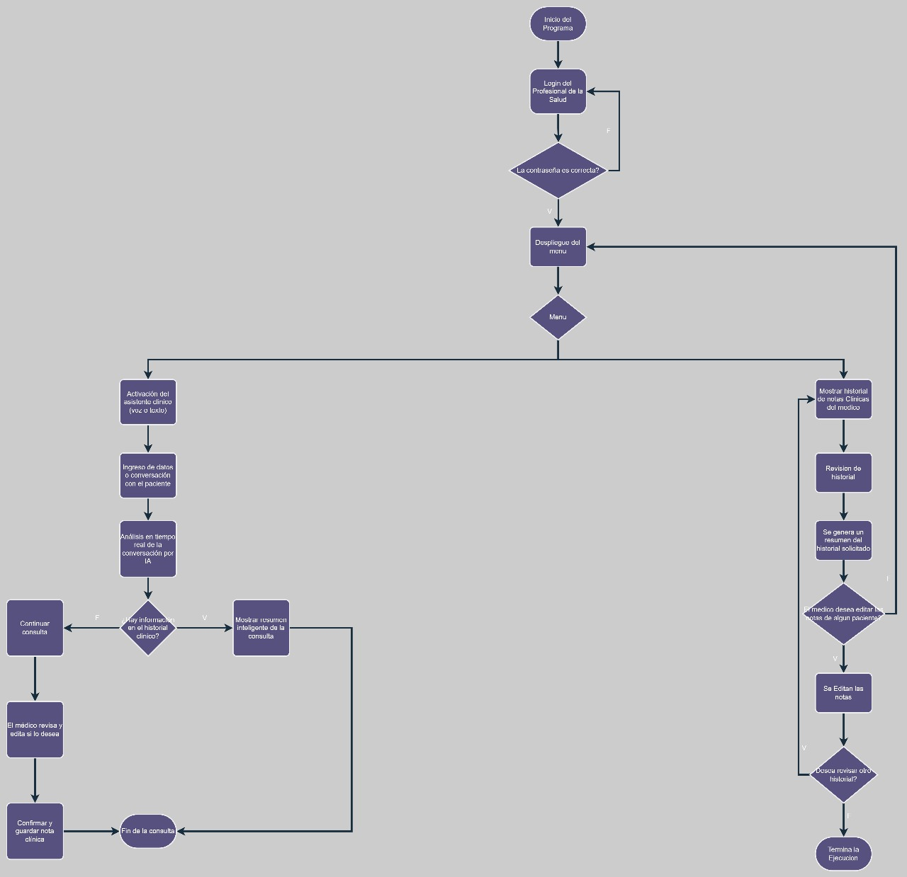
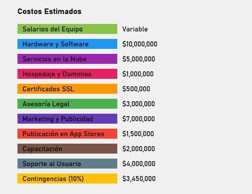

# 🩺 **TostApp** - Resumen Médico Inteligente 🤖

TostApp es una aplicación que mejora la calidad de la atención al paciente y la eficiencia del profesional de la salud mediante un asistente de IA que proporciona información relevante, soporte para la toma de decisiones y automatización de tareas administrativas directamente durante la consulta médica. El objetivo es reducir la carga cognitiva del profesional, minimizar errores, agilizar el flujo de trabajo y permitir un enfoque más centrado en el paciente. 🏥💬

---

## 🚀 **Descripción del Producto**

### **Problema que resuelve**:
TostApp resuelve el desafío de la **toma de notas durante las consultas médicas**, permitiendo a los médicos acceder a **resúmenes precisos** y **claros** de las interacciones con sus pacientes, ahorrando tiempo y mejorando la calidad del diagnóstico. ⏳⚕️

### **Público objetivo**:
- **Médicos** que necesitan resúmenes precisos y rápidos de las consultas para mejorar su análisis y diagnóstico. 👨‍⚕️📊
- **Pacientes** que se benefician de una experiencia de consulta más eficiente sin necesidad de interactuar con la app. 👩‍⚕️💬

---

## 🌟 **Funcionalidades Clave**

1. **🎤 Captura de voz del paciente**:
   El médico puede activar la grabación de voz del paciente para capturar lo que este dice durante la consulta. La app procesa lo dicho automáticamente. 🗣️

2. **🧠 Generación de resúmenes automáticos con IA**:
   El sistema de IA convierte las palabras del paciente en un **resumen claro** y conciso para el médico, destacando los puntos clave del diagnóstico. 🤖💡

3. **💻 Interfaz intuitiva para médicos**:
   El médico puede acceder fácilmente a los resúmenes generados, asegurándose de que toda la información sea **fácilmente accesible** y comprensible. 📑🩺

---

## 🖌️ **Diseño**

### **Pantallas clave**:

1. **🖥️ Pantalla de inicio - Médico**:
   El médico accede a la app y activa la grabación de audio con facilidad. Un botón claro permite comenzar y detener la grabación.

2. **📋 Pantalla de resúmenes - Médico**:
   Esta pantalla muestra el resumen generado por la IA, con un diseño claro y limpio para facilitar la lectura y comprensión.

### **Flujo de usuario**:

1. **Médico**:
   - Abre la app.
   - Activa la grabación de voz del paciente.
   - Finaliza la grabación y espera el resumen generado por IA.
   - Analiza el resumen para facilitar el diagnóstico.

---

## 🛠️ **Implementación**

INICIO

    // Paso 1: El médico inicia la grabación de la consulta
    MEDICO: Iniciar grabación de voz del paciente

    // Paso 2: Capturar la conversación (audio) durante la consulta
    GRABAR_AUDIO = iniciar_grabacion()

    // Paso 3: El médico finaliza la grabación cuando la consulta termina
    MEDICO: Detener grabación de voz

    // Paso 4: Enviar el archivo de audio a la IA para transcripción
    AUDIO_GRABADO = obtener_audio_grabado()
    TEXTO_TRANSCRITO = transcribir_audio_a_texto(AUDIO_GRABADO)

    // Paso 5: Procesar el texto para extraer información relevante (puntos clave)
    SI TEXTO_TRANSCRITO es válido:
        PUNTOS_CLAVE = extraer_informacion_relevante(TEXTO_TRANSCRITO)

        // Paso 6: Generar el resumen médico con los puntos clave
        RESUMEN_MEDICO = generar_resumen_IA(PUNTOS_CLAVE)

        // Paso 7: Mostrar el resumen médico al médico
        mostrar_resumen(RESUMEN_MEDICO)
    SINO:
        RETORNAR "Error en la transcripción del audio"
FIN

### **Estrategia de implementación**:

El médico será quien inicie la grabación utilizando un servicio de **grabación de voz nativo** de los dispositivos móviles para captar el audio del paciente. Luego, el backend procesa el audio utilizando modelos de IA que convierten el audio a texto. Finalmente, otro modelo de IA se encarga de **resumir** la información clave para el médico.

 ## Diagrama

## Costos estimados

## Datos A Considerar

## Flujo:  
1. Asociación con universidades y sus bases de datos médicas
2. Base de conocimiento de enfermedades  
3. Priorización con niveles de evidencia  

-- Algunas Featues no disponibles en Jira:

[Ver Jira ([https://tu-jira-url.com](https://tostapp.atlassian.net/jira/software/projects/SCRUM/settings/issuetypes/10004))

Features:  
- Búsqueda semántica contextual  
- Integración con UpToDate  
- Alertas de actualizaciones

## 🔧 QA Tester - Pruebas
Casos de prueba:

    🎤 Caso de prueba 1: Verificar que la grabación de audio se realiza correctamente y el archivo no está dañado.

    📝 Caso de prueba 2: Verificar que el resumen generado por IA es coherente y preciso respecto al audio proporcionado.

    💻 Caso de prueba 3: Verificar que la interfaz médica presenta el resumen correctamente y sin errores.

Errores esperados:

    No carga sonidos si hay permisos denegados.

    El historial no guarda si la sesión fue muy corta (<5 min).

  ## 🔧 DevOps - Pruebas/Mantenimiento
  
## 🛠️ Casos de Prueba Críticos para DevOps

### 🚀 Caso 1: Despliegue automático exitoso
**Descripción:** Al realizar un `push` a la rama principal (`main`), el sistema debe desplegar automáticamente la nueva versión en el entorno de staging sin errores.
- **Acción:** Realizar un `git push` a la rama `main`.
- **Resultado esperado:** El pipeline de CI/CD se ejecuta correctamente, y la aplicación se despliega en staging sin fallos.

---

### 🔄 Caso 2: Rollback automático en caso de fallo en el despliegue
**Descripción:** Si el despliegue falla, el sistema debe realizar un rollback automático al último despliegue exitoso.
- **Acción:** Simular un fallo en el pipeline de CI/CD.
- **Resultado esperado:** El sistema revierte al último despliegue exitoso y notifica el error.

---

### 📊 Caso 3: Ejecución de pruebas automatizadas en el pipeline
**Descripción:** El pipeline de CI/CD debe ejecutar automáticamente todas las pruebas unitarias y de integración sin fallos.
- **Acción:** Realizar un `push` con cambios de código.
- **Resultado esperado:** Todas las pruebas pasan correctamente. Si alguna falla, el despliegue se detiene y el equipo es notificado.

## 🚀 Estrategia de Despliegue y Mantenimiento
Despliegue:

    📱 Móvil: Google Play y App Store: Uso de Appcircle para el despliegue 🌍
    💻 General: Se harà enfasis en el despliegue para testeo con herramientas como GitHub Pages o Vercel
    

Mantenimiento:

    Actualizaciones periódicas: Se ofrecerán mejoras y nuevas funcionalidades a través de actualizaciones regulares en las tiendas de aplicaciones.

    Soporte para usuarios: Se habilitará un sistema de soporte en línea para médicos que tengan dudas o dificultades con el uso de la app.

    Monitoreo constante de IA: Se evaluará y actualizará el rendimiento de los algoritmos de IA para garantizar resúmenes cada vez más precisos y útiles.

Mejoras Futuras:

    🌐 Ampliación del soporte de idiomas: Integrar múltiples idiomas para pacientes de diferentes regiones. 🗣️🌍

    🧠 Mejoras en la precisión de IA: Continuar entrenando los modelos de IA para generar resúmenes más precisos y útiles. 🚀
    
    ⚕️ Transferencia directa de bases de datos nacionales - Objetivo: Eliminar la necesidad de registro previo.
    
    📝 Implementación de software de IA para diagnóstico:Funcionalidad: La IA haría preguntas para ayudar en el diagnóstico.
     Base: Utilizaría una base de datos de predicción de enfermedades

## 📅 Herramientas utilizadas

En este proyecto, se han empleado diversas herramientas y tecnologías para facilitar el desarrollo, diseño y despliegue. A continuación, se detallan algunas de las principales:

- **Deep Seek** 🐋 para **DevOps**  
  Utilizado para organizar y construir sistema DevOps

- **Draw.io** 🖋️ para **Gráficas**  
  Usado con el enfoque de tener un control y llevar a cabo con mas seguridad las ideas de nuestro proyecto

- **Ideogram.ai** 🌄 para **El Icono de la App**  
  Usado para crear el diseño y el icono de la aplicación que proporcionando una identidad visual única y moderna.

- **Canva** 🎨 
   Usado para hacer planes graficos de costos estimados

## 📝 Licencia

Distribuido bajo la Licencia MIT. Consulta el archivo LICENSE para más detalles. 📄
📬 Contacto

    👤 TostApp Team

    🌐 GitHub - TostApp
